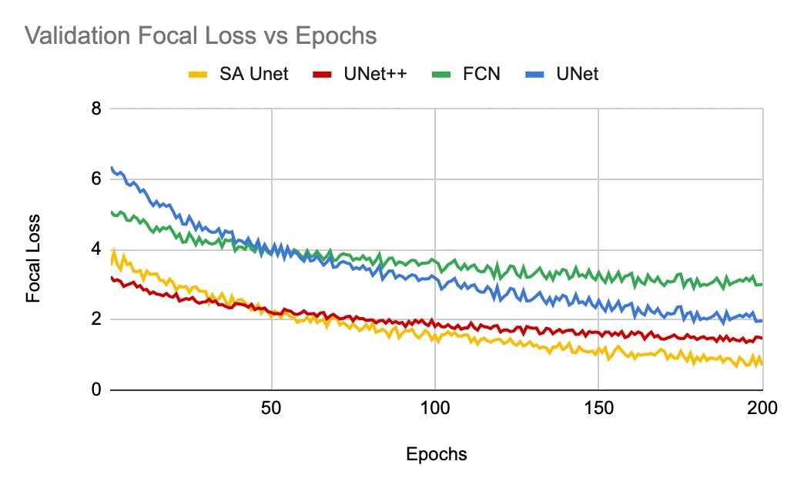

# Liver-Tumour-Segmentation

Proposed a novel architecture, Selective Attention UNet, for liver tumor segmentation in medical
imaging applications. Our experimental results demonstrate
that the proposed architecture outperforms several baseline
models including FCN, UNet++, and SegNet in terms of
accuracy and robustness metrics on the publicly available LiTS
dataset.
The Selective Attention UNet architecture leverages both
low-level and high-level features by incorporating skip connections between the encoder and decoder pathways, and uses a
selective attention mechanism to selectively focus on important
features while suppressing irrelevant ones. Our results show
that this architecture is able to accurately segment liver tumors
while preserving important spatial information.

